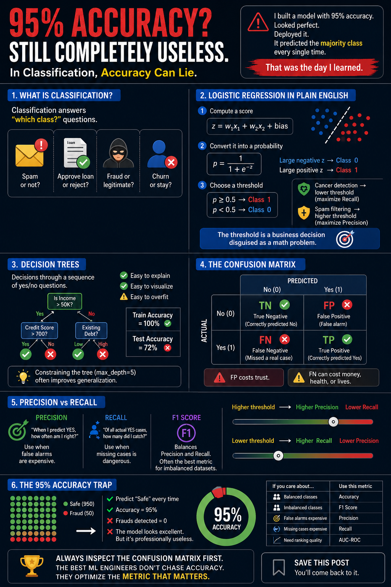

# Day 7 — Classification Models



## Overview

On Day 7, I moved from predicting continuous numbers with regression to predicting categories with classification. Using house-price data, I converted the original price-prediction problem into a multi-class classification problem: predicting whether a house belongs to the **Cheap**, **Mid**, or **Expensive** price tier.

This project covers the complete classification workflow—from preparing the data and training models to evaluating their performance with metrics that are more informative than accuracy alone.

## What I Learned

### 1. Classification vs. Regression

- **Regression** predicts a continuous value, such as a house price of `$287,000`.
- **Classification** predicts a category, such as `Cheap`, `Mid`, or `Expensive`.
- Binary classification has two possible classes, while multi-class classification has three or more.

### 2. Preparing the Data

I reused the house-price dataset and engineered useful features:

- `House_Age` from the year the house was built
- `Total_Rooms` from bedrooms and bathrooms
- `Is_New` to identify houses under ten years old
- `Is_MultiFloor` to identify houses with more than one floor

I then converted `Price` into the target variable `Price_Tier` with three classes. Categorical features were one-hot encoded, the target labels were encoded, and the data was split into training and testing sets.

Using `stratify=y` preserved the class distribution in both sets. Numerical inputs for Logistic Regression were standardized using `StandardScaler`.

### 3. Logistic Regression

Despite its name, Logistic Regression is a classification algorithm. It transforms a linear score into a probability using the sigmoid function:

```text
p = 1 / (1 + e^(-z))
```

For binary classification, the probability is compared with a decision threshold—commonly `0.5`—to select a class. Changing this threshold changes the balance between false positives and false negatives.

Logistic Regression is useful when:

- A fast and interpretable baseline is needed
- Class probabilities are important
- The decision boundary is approximately linear

### 4. Decision Tree Classifier

A Decision Tree predicts a class by asking a sequence of yes/no questions about the features. At each node, it selects a split that reduces class impurity, commonly measured with **Gini impurity** or **entropy**.

Decision Trees are useful because they:

- Model non-linear relationships
- Are easy to explain and visualize
- Do not require feature scaling
- Provide feature-importance scores

An unrestricted tree can memorize the training data and overfit. I compared a fully grown tree with a tree limited to `max_depth=5` to see how controlling model complexity improves generalization.

### 5. Classification Metrics

Accuracy alone can be misleading, especially with imbalanced classes. For example, a model that always predicts the majority class may have high accuracy while completely failing to identify the minority class.

The confusion matrix records four types of predictions:

|                       | Predicted Negative | Predicted Positive |
|-----------------------|-------------------:|-------------------:|
| **Actual Negative**   | True Negative (TN) | False Positive (FP) |
| **Actual Positive**   | False Negative (FN) | True Positive (TP) |

The main evaluation metrics are:

| Metric | Formula | Best used when |
|--------|---------|----------------|
| Accuracy | `(TP + TN) / Total` | Classes are reasonably balanced |
| Precision | `TP / (TP + FP)` | False alarms are costly |
| Recall | `TP / (TP + FN)` | Missing a positive case is costly |
| F1 Score | `2 × Precision × Recall / (Precision + Recall)` | A balance of precision and recall is needed |
| ROC-AUC | Area under the ROC curve | Comparing ranking performance across thresholds |

For the three price tiers, I used **macro F1**, which calculates the F1 score for every class and gives each class equal importance.

### 6. Model Evaluation and Comparison

I evaluated Logistic Regression and the depth-limited Decision Tree by using:

- Classification reports
- Confusion matrices
- Accuracy
- Macro F1 score
- Train-versus-test performance
- Decision Tree feature importances

This comparison showed that selecting a model is not only about finding the highest score. It also requires checking class-level errors, generalization, interpretability, and the real-world cost of false positives and false negatives.

## Project Workflow

1. Load the house-price dataset.
2. Engineer additional house features.
3. Convert house prices into three price tiers.
4. Encode categorical features and target labels.
5. Create stratified training and testing sets.
6. Scale features for Logistic Regression.
7. Train Logistic Regression and Decision Tree models.
8. Evaluate both models with classification reports and confusion matrices.
9. Compare accuracy and macro F1 scores.
10. Inspect overfitting and feature importance.

## Files in This Project

| File | Description |
|------|-------------|
| `Classification_Models.ipynb` | Notebook containing the full classification workflow |
| `House_Price_prediction.csv` | House-price dataset used for training and evaluation |
| `Day-7.png` | Visual created for Day 7 |
| `README.md` | Project summary and knowledge check |

## Key Takeaways

- Classification predicts labels instead of continuous values.
- Logistic Regression is a strong, interpretable baseline classifier.
- Decision Trees handle non-linear patterns but need constraints to prevent overfitting.
- A confusion matrix explains the kinds of mistakes a classifier makes.
- Precision, recall, and F1 score can reveal problems hidden by accuracy.
- The correct metric depends on the cost of false positives and false negatives.
- Good evaluation focuses on generalization, not training performance alone.

## Knowledge Check

### Questions

1. What is the main difference between regression and classification?
2. Why is `stratify=y` useful when splitting classification data?
3. How does `max_depth` help a Decision Tree?
4. When should recall be prioritized over precision?
5. Why can accuracy be misleading on an imbalanced dataset?

### Answers

1. **Regression predicts a continuous number, while classification predicts a category or class label.** For example, predicting an exact house price is regression, while predicting its price tier is classification.

2. **`stratify=y` preserves approximately the same class proportions in the training and testing sets.** This makes both sets more representative of the full dataset and produces a fairer evaluation.

3. **`max_depth` limits how many levels the tree can grow.** This reduces the chance that the tree memorizes noise in the training data and helps it generalize to unseen examples.

4. **Recall should be prioritized when missing a true positive is especially costly.** Examples include disease detection, fraud detection, and safety alerts, where a false negative may have serious consequences.

5. **Accuracy can hide poor minority-class performance.** If 95% of examples belong to one class, a model can reach 95% accuracy by always predicting that class while failing on every minority-class example. The confusion matrix, recall, and F1 score provide a more complete view.

## Tools and Libraries

- Python
- NumPy
- pandas
- Matplotlib
- Seaborn
- scikit-learn

## Next Step

The next topic is **ensemble learning**, including Random Forests and gradient-boosting models. These methods combine multiple learners to improve predictive performance and robustness.
